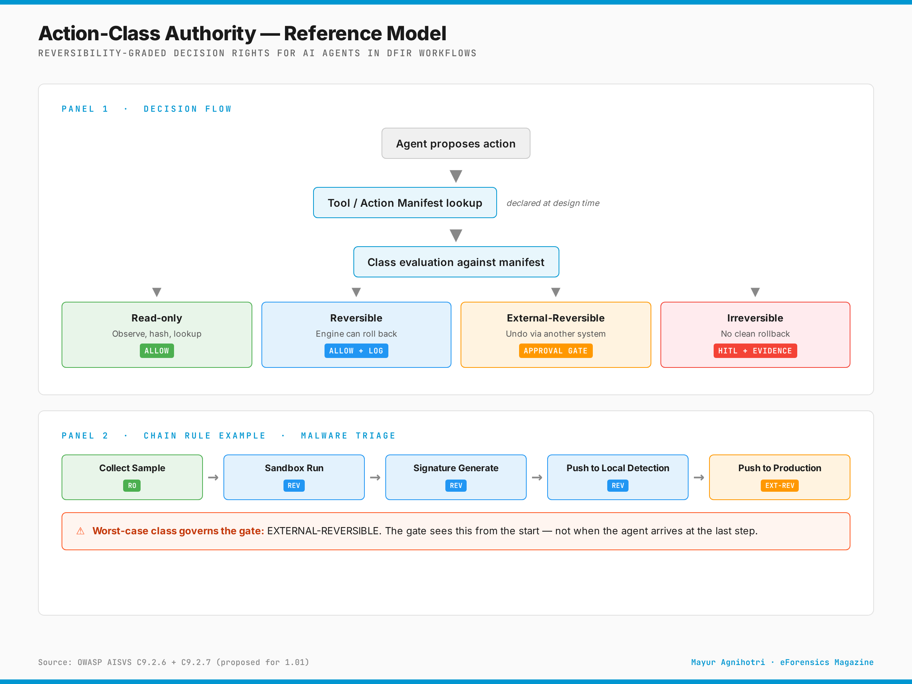

# Action-Class Authority for AI Agents

**A Verification-Side Reference**

**Version 1.0** — Published 2026-06-09

**Author:** Mayur Agnihotri
*Senior Information Security Specialist, StraightArc Technologies Pvt. Ltd.*
*Head of Threat Research, SecSphere SOC / SkyVirtRange*
*OWASP AISVS Contributor · CSA IAM Working Group Reviewer*

---



*Figure 1. Action-Class Authority — Reference Model. The gate evaluates the declared class from the tool/action manifest (Panel 1). For multi-step chains, the worst-case class across the chain governs the gate (Panel 2). Source: OWASP AISVS C9.2.6 + C9.2.7 (proposed for 1.01).*

---

## What this is

A practitioner reference for **what an AI agent is allowed to do without a human in the loop**, structured on the axis of **reversibility** rather than risk. Covers the four-class reversibility taxonomy, manifest-declared classification, the worst-case chain rule, and gate decisions per class. Anchored to OWASP AISVS C9.2.6 and C9.2.7 (proposed for 1.01, merged into main 2026-05-27).

## What this is not

- Not a competing standard. The architectural anchors live in OWASP AISVS C9.2.6 and C9.2.7 (research-chapter material, proposed for v1.01 inclusion) plus the C9.5 Agent Authorization, Delegation, and Continuous Enforcement section in v1.0 main (renumbered from C9.6 in the 2026-06-15 editorial cleanup). This document references them.
- Not a vendor product specification. The framework is vendor-neutral by design.
- Not a substitute for the chain-of-custody discipline that DFIR teams already practice. It is the same idea, applied one layer up.

## Who this is for

- **Standards-track contributors** working on agentic AI authorization (OWASP, CSA, IETF, CoSAI)
- **DFIR practitioners** evaluating AI-augmented triage workflows
- **SOC architects** designing AI-driven detection and response
- **CISOs** evaluating agentic AI deployment risk
- **Researchers** working on agent governance, runtime enforcement, or authorization

## How to read this

| If you want | Read |
|---|---|
| The argument in 5 minutes | Executive Summary + Figure 1 |
| The taxonomy in 15 minutes | Part II (Chapters 3–6) |
| The standards-track anchor | Part III (Chapters 7–9) |
| The DFIR application | Part IV (Chapters 10–12) |
| Implementation guidance | Part V (Chapters 13–15) |
| Full read | All 18 chapters, ~25-30 pages |

## How to cite

Plain text:
> Agnihotri, Mayur. (2026). *Action-Class Authority for AI Agents: A Verification-Side Reference.* Version 1.0.

BibTeX:
```bibtex
@misc{agnihotri2026actionclass,
  author       = {Agnihotri, Mayur},
  title        = {Action-Class Authority for AI Agents: A Verification-Side Reference},
  year         = {2026},
  month        = {June},
  version      = {1.0},
  howpublished = {Whitepaper, \url{https://github.com/Mayur021/action-class-authority}}
}
```

## License

Creative Commons Attribution 4.0 International (CC BY 4.0). See [LICENSE](LICENSE).

## Versions

| Version | Date | Notes |
|---|---|---|
| 1.0 | 2026-06-09 | Initial release |
| 1.0 (in-place errata) | 2026-06-15 | Errata pass: C9.6.4 reference reframed as C9.5 section (OWASP AISVS post-2026-06-15 v1.0 main chapter inventory; PR #928 + #934 renumbered C9.6 → C9.5 and removed C9.7 + C9.2.4). Re-verify control IDs before reprinting; chapter may change further before the 2026-06-24 v1.0 release. |

## Contributing

Errata, corrections, or technical objections welcome via:
- GitHub issues (when this repo is published)
- LinkedIn: linkedin.com/in/mayur-agnihotri

Joint contributions (e.g., adjacent schemas) are subject to prior agreement with the relevant co-authors. The chain-level audit schema referenced in Chapter 8 is joint peer-review work with Mallikarjunarao Sunke under CSA IAM Working Group review and is referenced here with permission.

## Related Work

- **OWASP AISVS** — github.com/OWASP/AISVS — verification standards for AI security
- **CSA NHI Working Group** — Defining Non-Human Identity paper (under peer review at IAM WG)
- **PieterKas/agent2agent-auth-framework** — IETF-track agent-to-agent authorization protocol
- **SANS AI Security Maturity Model** — Chris Cochran, SANS Institute
- **CoSAI WS4** — Secure Design Agentic Systems Working Group
- **AARM (CSA)** — Autonomous Action Runtime Management Working Group
